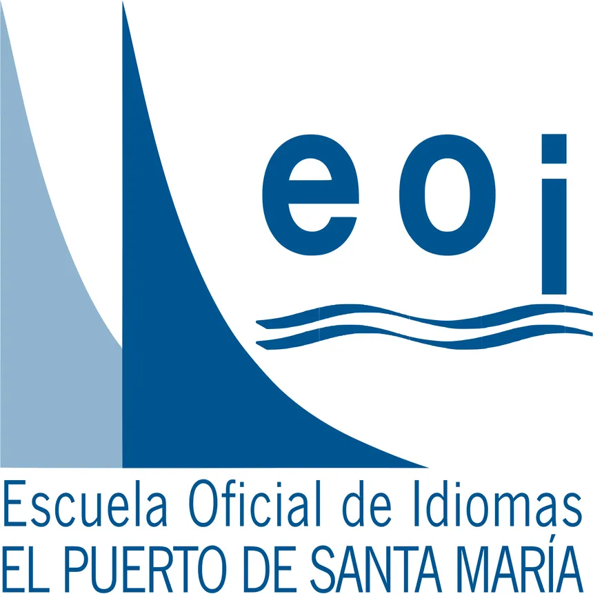

# IA y Docencia: Impulsando la Productividad en Escuelas de Idiomas

  

  

Repositorio para alojar los materiales de la formación en "IA en el aula" , del Grupo de Trabajo de la EOI El Puerto de Santa María durante el mes de febrero del 2025.

Duración de la formación: 2 sesiones de 3 horas en modalidad presencial

## Descripción de la la Actividad

El objetivo principal es explorar la integración de la IA en el ámbito educativo, y para ello hemos diseñado una actividad práctica que se desglosa en los sigiuientes apartados.

- **Fundamentos y Aplicaciones de la IA Generativa**: Explora cómo la IA genera contenido y amplía posibilidades educativas, desde texto a 3D.

- **Potenciando la Productividad Docente con IA**: Descubre cómo diferentes modelos de IA optimizan tareas docentes, desde la planificación hasta la evaluación.

- xxxxxxxxxxxxxxxxxxxxxxxxxxxx

- xxxxxxxxxxxxxxxxxxxxxxxxxxxx

## Materiales de la Actividad

### Sesion 1. XXXXXX

* [Presentación](https://0xmrivas.github.io/formacion-profesorado-IA-EOI-ElPuertodeSantaMaria/slides/sesion1)
* [Guía de la sesión](https://0xmrivas.github.io/formacion-profesorado-IA-EOI-ElPuertodeSantaMaria/docs/bloques/bloque1)

### Sesion 2. XXXXXX

* [Presentación](https://0xmrivas.github.io/formacion-profesorado-IA-EOI-ElPuertodeSantaMaria/slides/sesion2)
* [Guía de la sesión](https://0xmrivas.github.io/formacion-profesorado-IA-EOI-ElPuertodeSantaMaria/docs/bloques/bloque2)

## Autoria

Los materiales del curso han sido desarrollados por Manuel Rivas, profesor de enseñanza secundaria, especialidad en sistemas y aplicaciones informáticas. Si deseas seguir mi trabajo o contactarme, puedes encontrarme en [Twitter](https://twitter.com/0xmrivas).

## Licencia

Estos materiales están licenciados bajo la Licencia Creative Commons Atribución-CompartirIgual 4.0 Internacional (CC BY-SA 4.0). Esto significa que puedes compartir, copiar, redistribuir el material en cualquier medio o formato y adaptarlo, siempre y cuando otorgues el crédito apropiado, proporciones un enlace a la licencia e indiques si se han realizado cambios. Si remezclas, transformas o creas a partir del material, debes distribuir tus contribuciones bajo la misma licencia que el original.

Para ver una copia de esta licencia, visita [CC BY-SA 4.0](https://creativecommons.org/licenses/by-sa/4.0/).
