## Inteligencia artificial

---
## Sesiones propuestas

Sesión 1: Una Inteligencia Artificial para la creatividad <!-- .element: class="fragment" -->

Sesión 2: Una Inteligencia Artificial para la  productividad <!-- .element: class="fragment" -->
---
## Una Inteligencia Artificial para la creatividad

---
## ¿Qué es la Inteligencia Artificial Generativa?

## ¿Qué es un modelo de IA?

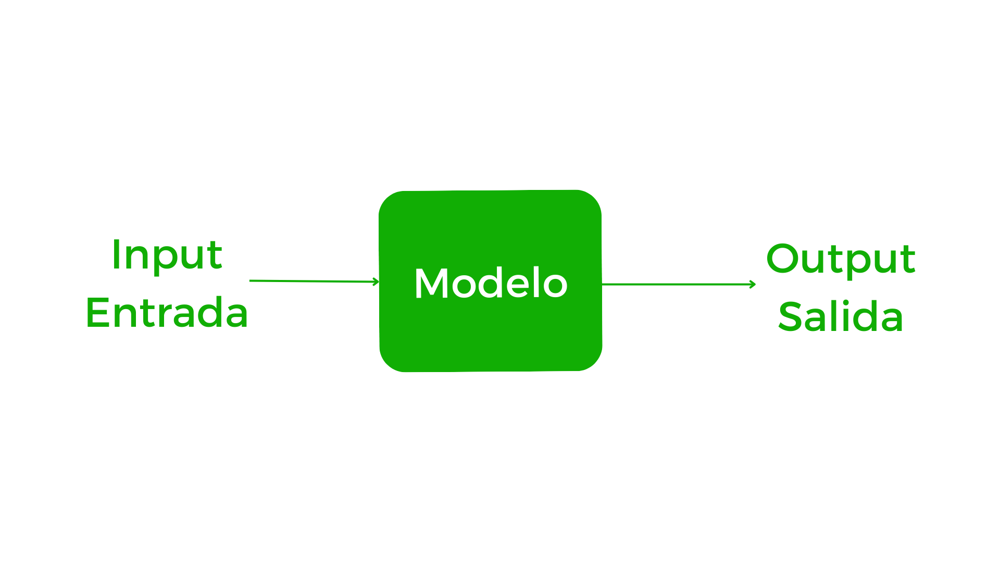

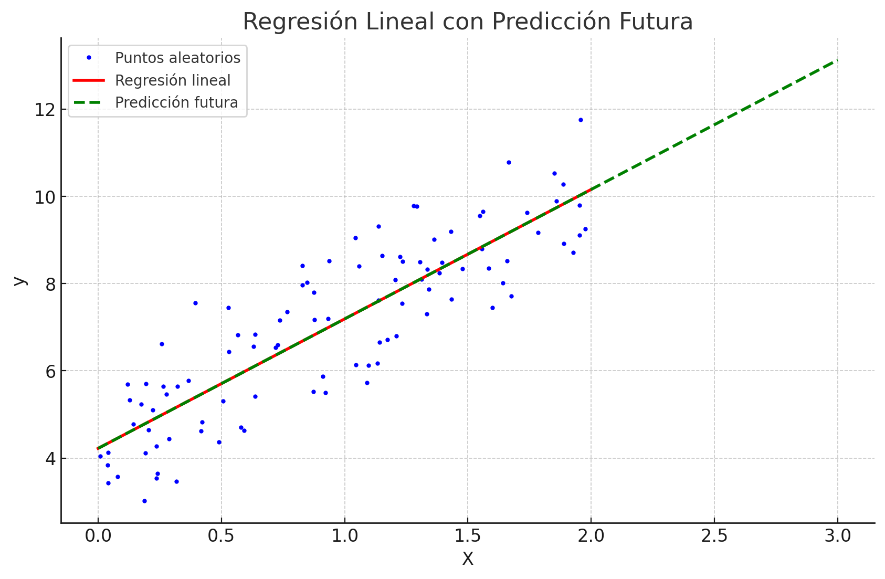

## Machine Learning

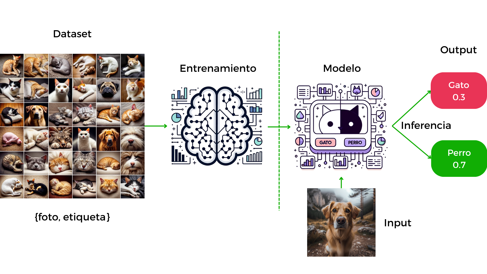

## Deep Learning

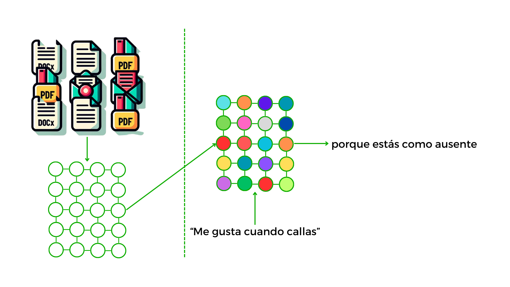

Una gran cantidad de datos

Estructura compleja basada en redes neuronales de varias capas

Requiere más capacidad de procesamiento

## Foundation Models

Pasamos de modelos que realizan tareas concretas

A modelos capaces de realizar tareas generales <!-- .element: class="fragment" -->

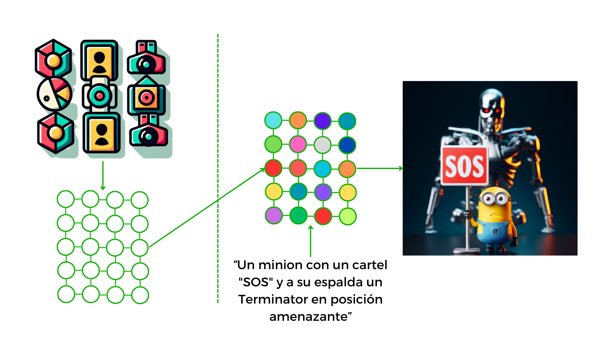

## Inteligencia Artificial Generativa

Generación y edición

Texto <!-- .element: class="fragment" -->

Audio <!-- .element: class="fragment" -->

Imagen → Vídeo <!-- .element: class="fragment" -->

3D <!-- .element: class="fragment" -->

## Modalidad de los modelos

Unimodal → Multimodal <!-- .element: class="fragment" -->

Entrenamiento con varios tipos de datos <!-- .element: class="fragment" -->

## Propietarios o de libre acceso

Propietarios: Solamente pueden usarse a través de las vías que oferta la empresa propietaria (no puedes ejecutarlo en tu equipo) <!-- .element: class="fragment" -->

De libre acceso: Puedes ejecutarlo en tu equipo (si es lo suficientemente potente) o elegir a través de que vía usarlo <!-- .element: class="fragment" -->

¡Cuidado! Aunque un modelo sea de libre acceso, tiene una licencia asociada <!-- .element: class="fragment" -->

## Personalización

Fine-tuning <!-- .element: class="fragment" -->

Texto: Resolver mejor tareas concretas o mejorar rendimiento en campos específicos <!-- .element: class="fragment" -->

Imágenes: Aprender a dibujar nuevos conceptos <!-- .element: class="fragment" -->

Audio: Mejor comprensión de entornos o idiomas <!-- .element: class="fragment" -->
---
## Cómo funciona un modelo de lenguaje

Large Language Model (LLM)

Modelos de Inteligencia Artificial Generativa para completar texto <!-- .element: class="fragment" -->

Objetivo: ser capaz de resolver el mayor número de tareas en general <!-- .element: class="fragment" -->

## Instruct Fine-Tuning

De completar texto a proporcionar respuestas <!-- .element: class="fragment" -->

Chatbot "inteligente" <!-- .element: class="fragment" -->

RLHF es uno de los métodos utilizados <!-- .element: class="fragment" -->

## Tipos de mensajes en un chatbot

User <!-- .element: class="fragment" -->

Assistant <!-- .element: class="fragment" -->

System (o developer) <!-- .element: class="fragment" -->

## Cómo funciona realmente un LLM: Una aproximación técnica

<small>Fuente: [Generative AI exists because of the transformer](https://ig.ft.com/generative-ai/)</small>

## Entrenamiento: Tokenización

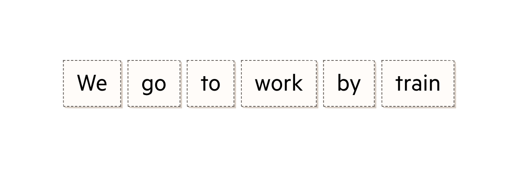

**We:** 7674	**go:** 7653	**to:** 66533	**work:** 8927

## Entrenamiento: Observación

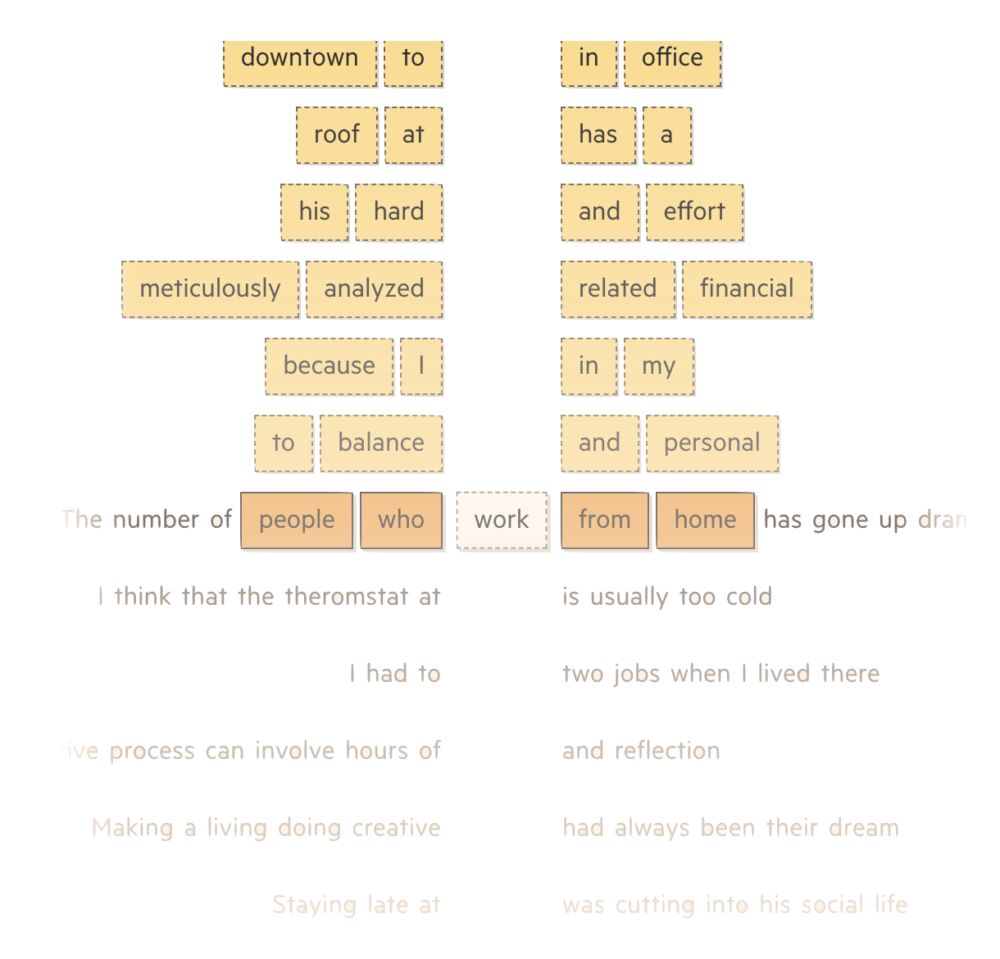

## Entrenamiento: Conteo de probabilidades

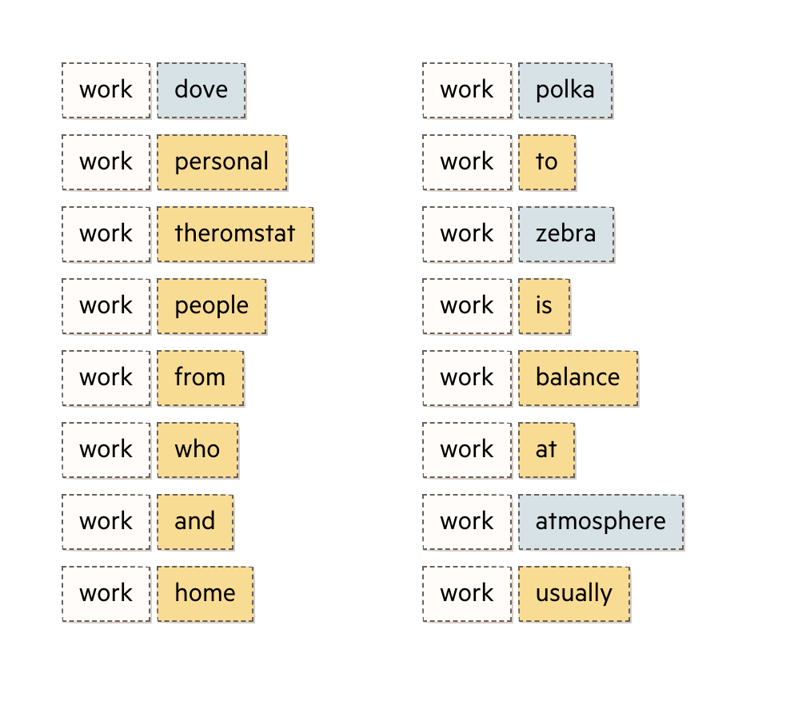

## Entrenamiento: Embedding

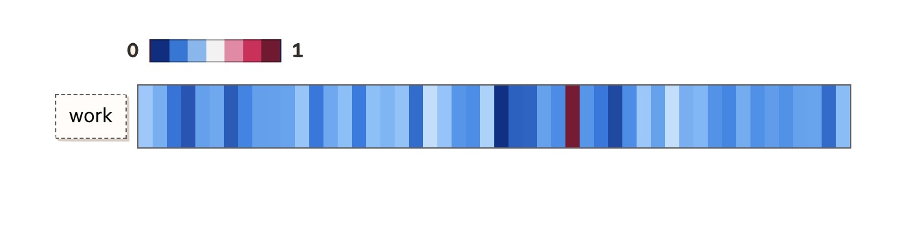

## Entrenamiento: Creación de embeddings

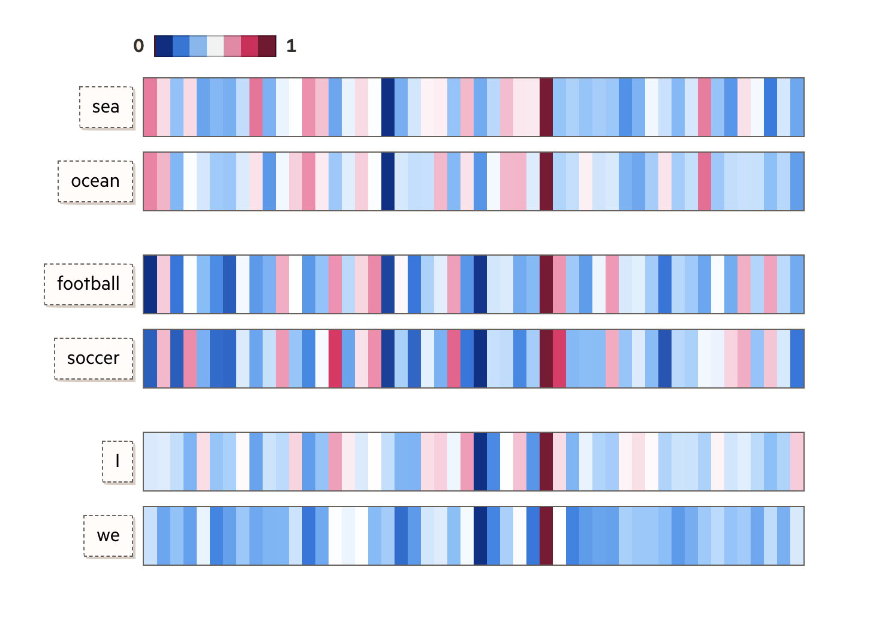

## Entrenamiento: Distancia entre embeddings

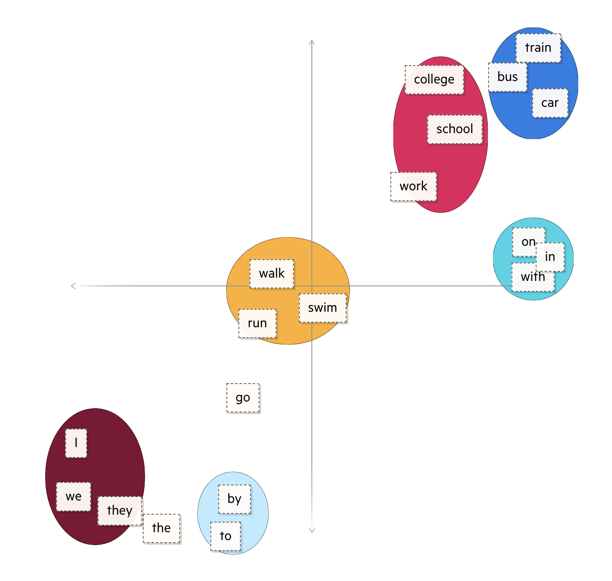

## Inferencia: Prompt de entrada

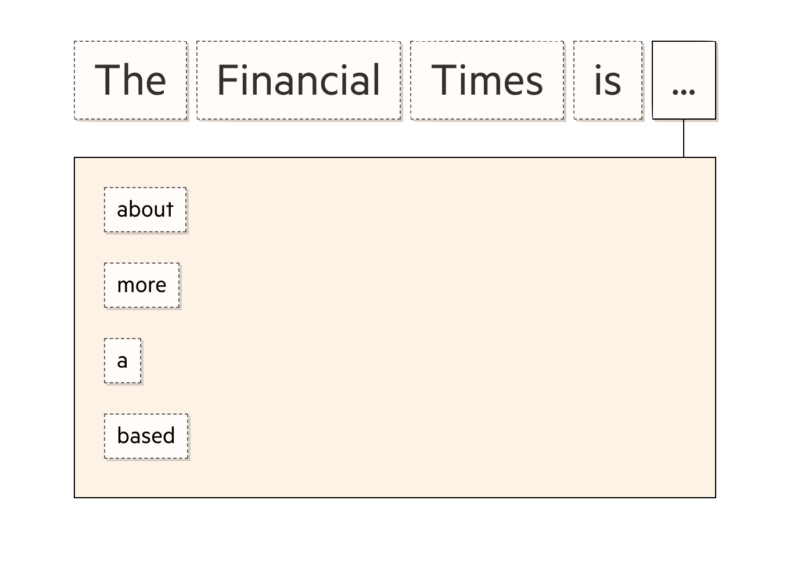

## Inferencia: Varias posibilidades

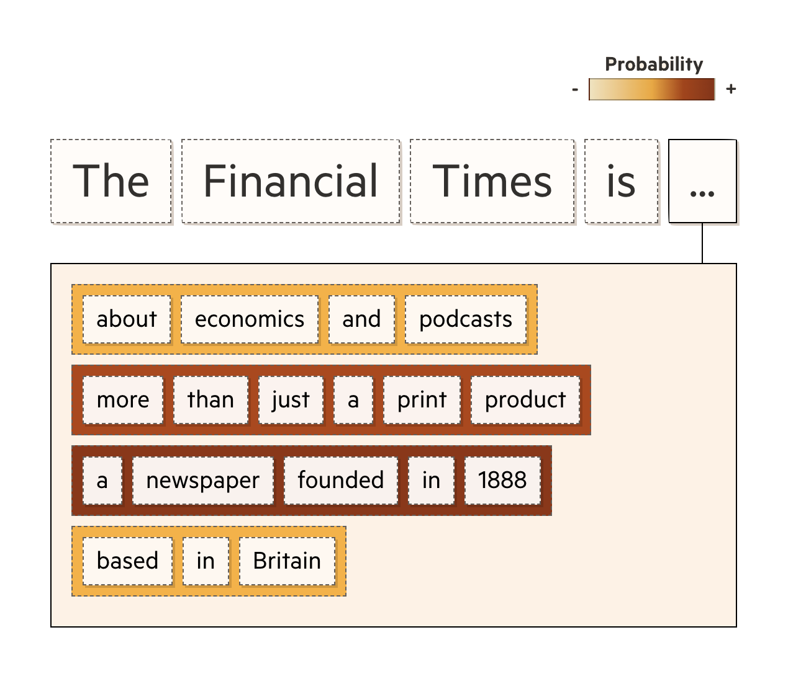

## Inferencia: Elección para completar

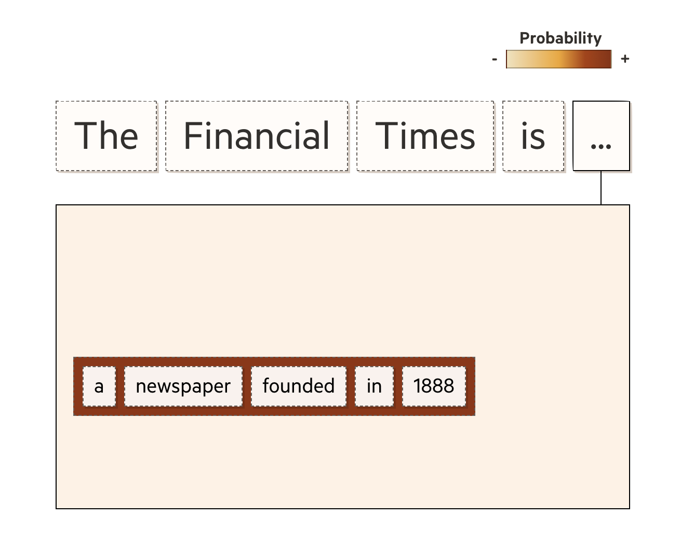

## Cómo funciona realmente un LLM: Una aproximación intuitiva

## La analogía del estudiante

Fase de estudio (entrenamiento)

Una petición es un examen (no recuerda exámenes anteriores) <!-- .element: class="fragment" -->

Puede tratar de responder lo que no sabe (alucinaciones) <!-- .element: class="fragment" -->

Le puedes dar pistas en el enunciado (contexto), pero su longitud es limitada (número de tokens) <!-- .element: class="fragment" -->

Puede volver a la habitación y centrarse en un tema concreto (fine-tuning) <!-- .element: class="fragment" -->

## ¿Qué pasa si se le dan herramientas al estudiante?

## Parámetros más comunes de un LLM

Tamaño: Medido en miles de millones de parámetros (B)

Contexto: Memoria a corto plazo (número máximo de tokens) <!-- .element: class="fragment" -->

Temperatura: Medida de la creatividad <!-- .element: class="fragment" -->

Funciones: Herramientas a las que tiene acceso <!-- .element: class="fragment" -->

Nuevo en 2024: Tiempo de inferencia (solo razonadores)

## ¿Cómo obtener las mejores respuestas de un LLM?

Prompt Engineering

Háblale como si fuera una persona (pero no lo es) <!-- .element: class="fragment" -->

Comprende su funcionamiento para comprender sus respuestas <!-- .element: class="fragment" -->

Sigue unos principios básicos <!-- .element: class="fragment" -->

## 1 - Escribe instrucciones claras y específicas

Proporciona información y usa delimitadores para indicar las distintas partes de tu petición <!-- .element: class="fragment" -->

Solicita respuestas estructuradas en el formato que necesites <!-- .element: class="fragment" -->

Proporciona ejemplos (few-shot) <!-- .element: class="fragment" -->

## 2 - Dale tiempo para "pensar"

Especifica los pasos para realizar la tarea <!-- .element: class="fragment" -->

Solicita que razone sobre los pasos que tendría que dar antes de proporcionar una respuesta <!-- .element: class="fragment" -->

"Respira hondo y resuelve este problema paso por paso" <!-- .element: class="fragment" -->

## 3 - Indica unas pautas de comportamiento

Instrucciones personalizadas: System <!-- .element: class="fragment" -->

¿Qué quieres que sepa sobre ti? <!-- .element: class="fragment" -->

¿Cómo te gustaría que te respondiera? <!-- .element: class="fragment" -->
---
## Una conversación para lograr tus objetivos

## Pregúntate

¿Cómo lo haces tú? <!-- .element: class="fragment" -->

¿En qué parte del proceso quiero la asistencia de una IA? <!-- .element: class="fragment" -->

Si otra persona me encargara ese trabajo a mí... ¿Qué información necesito para resolverlo adecuadamente? <!-- .element: class="fragment" -->

Note:

https://huggingface.co/spaces/ShubhamMhaske/MarkItDown_Microsoft
---
## ¿Qué tareas puede realizar un LLM?

## Las tareas que mejor realiza

Resúmenes <!-- .element: class="fragment" -->

Preguntas y respuestas sobre un texto proporcionado <!-- .element: class="fragment" -->

Traducción <!-- .element: class="fragment" -->

Planificación <!-- .element: class="fragment" -->

Redacción en diferentes estilos de textos genéricos <!-- .element: class="fragment" -->

Escritura de código sencillo y razonamiento sobre el mismo

Explicación de conceptos complejos, dada una descripción previa <!-- .element: class="fragment" -->

Análisis de sentimiento <!-- .element: class="fragment" -->

Invención de historias, poesías... <!-- .element: class="fragment" -->

¿Puedes imaginar más? <!-- .element: class="fragment" -->

## Las tareas que peor realiza

Cálculos matemáticos <!-- .element: class="fragment" -->

Tareas que conlleven conocimiento factual no proporcionado <!-- .element: class="fragment" -->

Humor y sarcasmo <!-- .element: class="fragment" -->

*Razonamientos excesivamente complejos <!-- .element: class="fragment" -->

---
## Repite conmigo: Todo no es una IA

ChatGPT no es una IA

Es una aplicación que utiliza modelos de IA (generativa) <!-- .element: class="fragment" -->

La mayor parte de aplicaciones no son más que ChatGPT Wrappers <!-- .element: class="fragment" -->

## Wrappers

Ventajas: Funcionalidades preparadas <!-- .element: class="fragment" -->

Desventajas: Escasa personalización, dependencia, ausencia de control <!-- .element: class="fragment" -->

Muy pocos sobrevivirán <!-- .element: class="fragment" -->

## Ejemplos

[BRISK Teaching](https://www.briskteaching.com/es)

[MagicSchool](https://www.magicschool.ai)

---

## Wrappers especializados para aprendizaje de idiomas

## Comprensión lectora

[Twee](https://app.twee.com/)

[questionwell](https://app.questionwell.org/)

## Expresión escrita

[grammarly](https://app.grammarly.com/) - Solo en inglés

[quillbot](https://quillbot.com/)
---
## Desbloqueando tu creatividad a través de la tecnología

## Creando una imagen

[FreePik](https://www.freepik.es)

[Recraft](https://www.recraft.ai)

## Creando una canción

[udio](https://www.udio.com)

[SUNO](https://suno.com)

## Creando un vídeo

[genmo](https://www.genmo.ai)

[runway](https://runwayml.com)

[Pika](https://pika.art)

---
## El coste de la IAG

El entrenamiento es MUY caro

La inferencia también, crece exponencialmente con la capacidad <!-- .element: class="fragment" -->

Uso gratuito = limitaciones y/o modelos menos capaces <!-- .element: class="fragment" -->

## Opciones de pago

Individual: Los beneficios para ti <!-- .element: class="fragment" -->

Institucional: Fuera de nuestro control <!-- .element: class="fragment" -->

Pago por uso: Solución más controlable de momento <!-- .element: class="fragment" -->

## Ejemplo: ChatGPT

Sin cuenta: Únicamente chat con GPT-4o-mini <!-- .element: class="fragment" -->

Cuenta gratuita: Chat GPT-4o (limitado), historial, memoria, personalización, modo de voz básico, herramientas: búsqueda en internet y canva (limitado), uso de GPTs (limitado), generación de imágenes (limitado a 3), modo de voz avanzado (limitado) <!-- .element: class="fragment" -->

Cuenta Plus: Elección de modelo, creación de GPTs y proyectos

Cuenta Pro: modo o1 pro <!-- .element: class="fragment" -->

## Ejemplo: Gemini for Google Workspace

Cuenta gratuita si lo activa el administrador <!-- .element: class="fragment" -->

Acceso al modelo básico y a generar imágenes <!-- .element: class="fragment" -->

Cuentas de pago: Integración con Drive y suite ofimática <!-- .element: class="fragment" -->
---
## Las respuestas que estábais buscando

## Preguntas genéricas respondidas en la sesión

¿Cómo usar la IA para resolver y generar problemas educativos? <!-- .element: class="fragment" -->

¿Cómo personalizar las instrucciones para necesidades docentes específicas? <!-- .element: class="fragment" -->

¿Cómo diseñar actividades con diferentes estrategias de resolución? <!-- .element: class="fragment" -->

¿Cómo adaptar explicaciones a diferentes necesidades del alumnado? <!-- .element: class="fragment" -->

## ¿Cómo preparar interacciones predefinidas para el alumnado?

Necesitas personalizar un asistente <!-- .element: class="fragment" -->

ChatGPT: Necesitas Plus para crearlo. Las cuentas gratuitas pueden interactuar de forma limitada <!-- .element: class="fragment" -->

HuggingChat: Sin limitaciones de interacción. Instrucciones abiertas y modelos menos capaces <!-- .element: class="fragment" -->

## ¿Cómo enseñar al alumnado a formular preguntas efectivas a la IA?

De la misma forma que aprendemos el resto <!-- .element: class="fragment" -->

Enseñando qué es y qué no <!-- .element: class="fragment" -->

Ejemplos de utilización en clase <!-- .element: class="fragment" -->

## ¿Es posible resolver problemas mediante el análisis de imágenes?

Necesitas un modelo de visión, que sea realmente de visión <!-- .element: class="fragment" -->

Problemas más complejos, modelo más capaz <!-- .element: class="fragment" -->

o1 en ChatGPT Plus o probar suerte en alternativas libres <!-- .element: class="fragment" -->

A la carta: Pago por interacción <!-- .element: class="fragment" -->

## ¿Cómo implementar progresión de dificultad en los ejercicios?

La dificultad es algo difícil de modelar <!-- .element: class="fragment" -->

Casi imposible a través de aplicaciones no preparadas para ello <!-- .element: class="fragment" -->

Una buena opción es tener ejemplos preparados y dirigir la progresión <!-- .element: class="fragment" -->
---
## Personaliza tu experiencia con un LLM

Habla su mismo lenguaje: [Markdown](https://stackedit.io) 
<!-- .element: class="fragment" -->

Crea un prompt adecuado y almacénalo <!-- .element: class="fragment" -->

Recuerda añadir ejemplos propios que definan tu estilo <!-- .element: class="fragment" -->
---
<!-- .slide: data-background-video="../imagenes/chatgpt.mp4" data-background-opacity="0.6" data-background-video-loop data-background-video-muted -->

## ¿Dudas?
---

## ¡ Escanea, y Opina !

<small>https://app.wooclap.com/MJGERM/questionnaires/6790cee12320db99e830e26d</small>

---

## Recursos

<small>https://0xmrivas.github.io/formacion-profesorado-IA-EOI-ElPuertodeSantaMaria/</small>

---

## Contacto

 Manuel J. Rivas Sández 
 <small>
- **Email:** [xmrivas@proton.me](mailto:xmrivas@proton.me)
- **Telegram:** [@xmrivas](https://t.me/xmrivas)
- **Twitter:** [@0xmrivas](https://twitter.com/0xmrivas)

- 💼 **PES SAI en el IES Rafael Alerti**

🛡️ Amante del **Hacking Etico** y la **Seguridad Informática**
</small> 