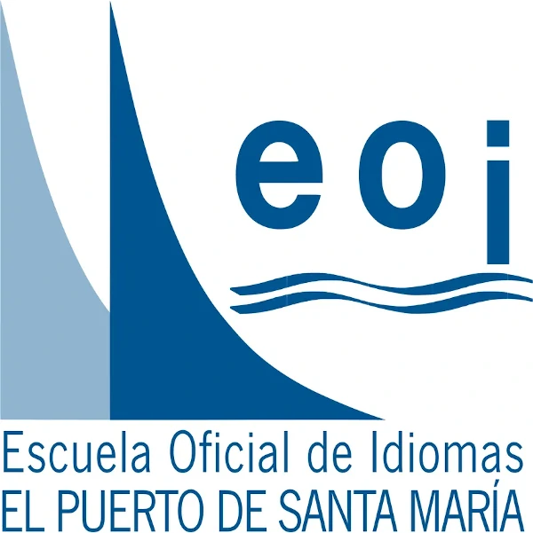

## IA y Docencia

#### Impulsando la productividad en Escuelas de Idiomas

---

## Una Inteligencia Artificial para la productividad

---

---
<!-- .slide: data-background-video="../imagenes/chatgpt.mp4" data-background-opacity="0.6" data-background-video-loop data-background-video-muted -->

## ¿Dudas?
---

## ¡ Escanea, y Opina !

<small>https://app.wooclap.com/MJGERM/questionnaires/67aa61e20b51f67bd3472717</small>

---

## Recursos

<small>https://0xmrivas.github.io/formacion-profesorado-IA-EOI-ElPuertodeSantaMaria/</small>

---

## Contacto

 Manuel J. Rivas Sández 
 <small>
- **Email:** [xmrivas@proton.me](mailto:xmrivas@proton.me)
- **Telegram:** [@xmrivas](https://t.me/xmrivas)
- **Twitter:** [@0xmrivas](https://twitter.com/0xmrivas)

- 💼 **PES SAI en el IES Rafael Alerti**

🛡️ Amante del **Hacking Etico** y la **Seguridad Informática**
</small> 