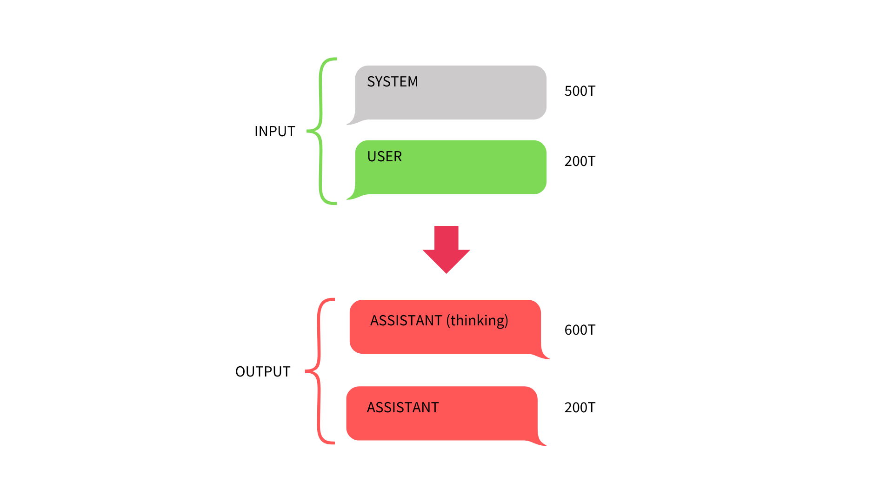
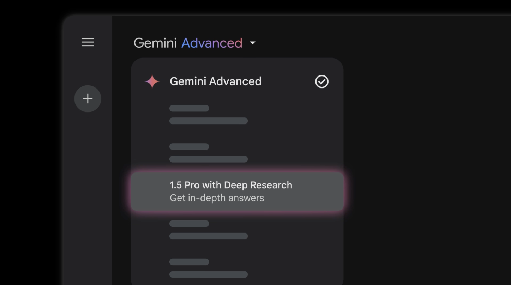
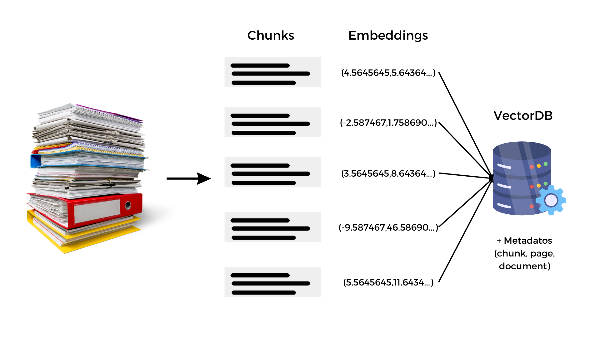
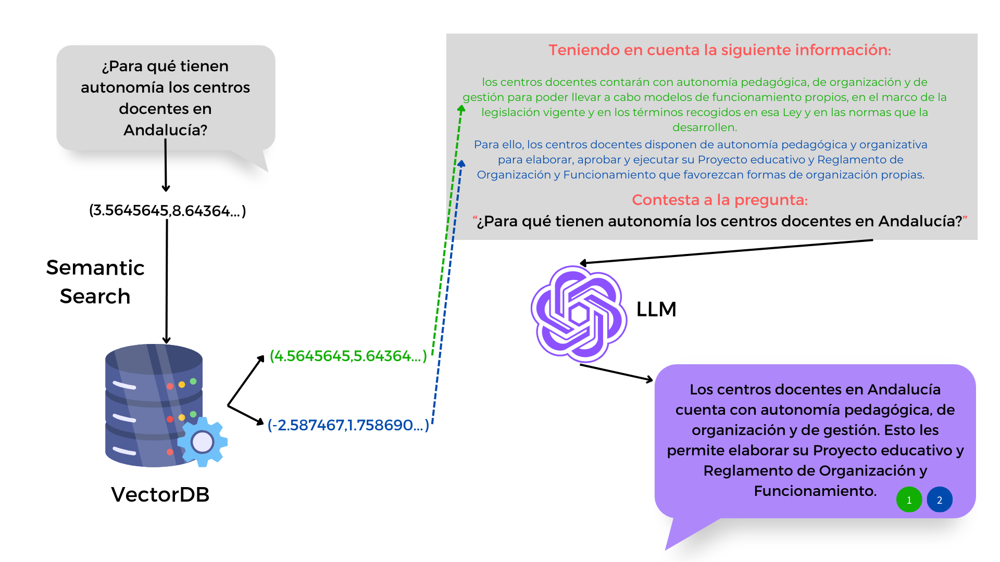

## Inteligencia artificial

---

## Una Inteligencia Artificial para el aprendiizaje

---

## ¿Han surgido dudas desde la sesión anterior?

---

## Lo que quedó pendiente

En algunos modelos de [HuggingChat](https://huggingface.co/chat/assistants) se pueden modificar parámetros (como temperatura) 
<!-- .element: class="fragment" -->

Generación de imágenes con texto <!-- .element: class="fragment" -->

Los modelos razonadores <!-- .element: class="fragment" -->

## Los modelos razonadores

Descubrimiento del "Piensa paso a paso" <!-- .element: class="fragment" -->

Entrenamiento con cadenas de pensamiento <!-- .element: class="fragment" -->

Aprendizaje por refuerzo <!-- .element: class="fragment" -->

## De modelos de lenguaje a modelos razonadores

- Nivel 1: Chatbots <!-- .element: class="fragment" -->

- Nivel 2: Razonadores <!-- .element: class="fragment" -->

- Nivel 3: Agentes <!-- .element: class="fragment" -->

- Nivel 4: Innovadores <!-- .element: class="fragment" -->

- Nivel 5: Organizaciones <!-- .element: class="fragment" -->

Note:
- Nivel 1: Chatbots: Sistemas de IA conversacional que dominan el lenguaje humano y pueden interactuar de manera efectiva en tareas básicas.

- Nivel 2: Razonadores: Modelos que alcanzan un nivel de resolución de problemas comparable al humano, abordando problemas abstractos y desafiantes.

- Nivel 3: Agentes: Sistemas que no solo comprenden y razonan, sino que también pueden tomar acciones en el mundo real para cumplir objetivos.

- Nivel 4: Innovadores: IA que puede contribuir directamente a la invención y la innovación, generando ideas y diseños nuevos.

- Nivel 5: Organizaciones: Sistemas de IA que operan como entidades completas, capaces de realizar el trabajo de una organización entera de manera eficiente y autónoma.

---

## Un asistente para la búsqueda de información

<small>https://www.perplexity.ai</small>

## Algunos usos educativos

Investigación guiada y validación de fuentes <!-- .element: class="fragment" -->

Preparación de debates con búsqueda social <!-- .element: class="fragment" -->

Búsquedas en vídeos o artículos académicos <!-- .element: class="fragment" -->

Creación de espacios para buscar en archivos o sitios web específicos <!-- .element: class="fragment" -->

## Hacia dónde avanza este paradigma

---
## Cómo se enriquece el contexto de un modelo de lenguaje

## ¿Qué es el RAG?

---

## El cuaderno de aprendizaje inteligente

<small>https://notebooklm.google.com</small>

## Algunos usos educativos

Aprendizaje a partir de textos complejos <!-- .element: class="fragment" -->

Aprendizaje a partir de elementos multimedia <!-- .element: class="fragment" -->

Guías de estudio personalizadas <!-- .element: class="fragment" -->

Resumir y traducir a distintos idiomas <!-- .element: class="fragment" -->

## Una fuente, infinitas formas de personalizar el aprendizaje

El nuevo material educativo interactivo <!-- .element: class="fragment" -->

Un podcast para cada caso de uso <!-- .element: class="fragment" -->

¿Cómo podemos crear un documento de texto? <!-- .element: class="fragment" -->

Creando diagramas

¿Presentaciones también? <!-- .element: class="fragment" -->

---

## Herramientas especializadas para aprendizaje de idiomas

## Comprensión oral

- [ttsmaker](https://ttsmaker.com/)<!-- .element: class="fragment" -->
- [elevenlabs](https://elevenlabs.io/)<!-- .element: class="fragment" -->
- [fliki](https://app.fliki.ai/)<!-- .element: class="fragment" -->
- [Heygen](https://app.heygen.com/)<!-- .element: class="fragment" -->
- [rask](https://es.rask.ai/)<!-- .element: class="fragment" -->

Note:
- https://omnihuman-lab.github.io/
- https://omnihuman-lab.github.io/

## Expresion oral

- ChatGPT Modo voz avanzado<!-- .element: class="fragment" -->

---

## El análisis crítico en tiempos de la IA

¿Cómo distinguimos la verdad en un mundo que puede ser generado? <!-- .element: class="fragment" -->

Necesitamos conocimiento <!-- .element: class="fragment" -->

Necesitamos crear una red de fuentes de confianza <!-- .element: class="fragment" -->

Necesitamos entrenar el pensamiento crítico <!-- .element: class="fragment" -->

---

<!-- .slide: data-background-video="../imagenes/chatgpt.mp4" data-background-opacity="0.6" data-background-video-loop data-background-video-muted -->

## ¿Dudas?
---

## ¡ Escanea, y Opina !

<small>https://app.wooclap.com/MJGERM/questionnaires/67c9e89853d2f8a371985d1e</small>

---

## Recursos

<small>https://0xmrivas.github.io/formacion-profesorado-IA-EOI-ElPuertodeSantaMaria/</small>

---

## Contacto

 Manuel J. Rivas Sández 
 <small>
- **Email:** [0xmrivas@proton.me](mailto:0xmrivas@proton.me)
- **Telegram:** [@xmrivas](https://t.me/xmrivas)
- **Twitter:** [@0xmrivas](https://twitter.com/0xmrivas)

- 💼 **PES SAI en el IES Rafael Alerti**

🛡️ Amante del **Hacking Etico** y la **Seguridad Informática**
</small> 