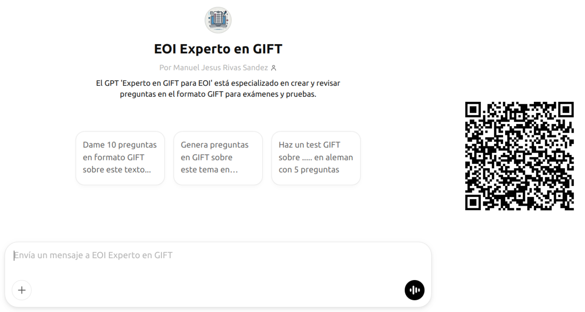
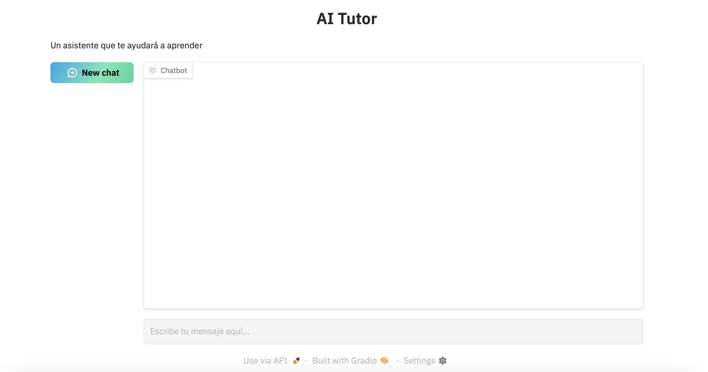

## Inteligencia artificial

---

## Una Inteligencia Artificial para la productividad

---

## ¿Han surgido dudas desde la sesión anterior?

---

## Lo que quedó pendiente

En algunos modelos de [HuggingChat](https://huggingface.co/chat/assistants) se pueden modificar parámetros (como temperatura) 
<!-- .element: class="fragment" -->

Generación de imágenes con texto <!-- .element: class="fragment" -->

Los modelos razonadores <!-- .element: class="fragment" -->

## Los modelos razonadores

Descubrimiento del "Piensa paso a paso" <!-- .element: class="fragment" -->

Entrenamiento con cadenas de pensamiento <!-- .element: class="fragment" -->

Aprendizaje por refuerzo <!-- .element: class="fragment" -->

## De modelos de lenguaje a modelos razonadores

- Nivel 1: Chatbots <!-- .element: class="fragment" -->

- Nivel 2: Razonadores <!-- .element: class="fragment" -->

- Nivel 3: Agentes <!-- .element: class="fragment" -->

- Nivel 4: Innovadores <!-- .element: class="fragment" -->

- Nivel 5: Organizaciones <!-- .element: class="fragment" -->

Note:
- Nivel 1: Chatbots: Sistemas de IA conversacional que dominan el lenguaje humano y pueden interactuar de manera efectiva en tareas básicas.

- Nivel 2: Razonadores: Modelos que alcanzan un nivel de resolución de problemas comparable al humano, abordando problemas abstractos y desafiantes.

- Nivel 3: Agentes: Sistemas que no solo comprenden y razonan, sino que también pueden tomar acciones en el mundo real para cumplir objetivos.

- Nivel 4: Innovadores: IA que puede contribuir directamente a la invención y la innovación, generando ideas y diseños nuevos.

- Nivel 5: Organizaciones: Sistemas de IA que operan como entidades completas, capaces de realizar el trabajo de una organización entera de manera eficiente y autónoma.

---

## Un asistente para la búsqueda de información

<small>https://www.perplexity.ai</small>

## Algunos usos educativos

Investigación guiada y validación de fuentes <!-- .element: class="fragment" -->

Preparación de debates con búsqueda social <!-- .element: class="fragment" -->

Búsquedas en vídeos o artículos académicos <!-- .element: class="fragment" -->

Creación de espacios para buscar en archivos o sitios web específicos <!-- .element: class="fragment" -->

## Hacia dónde avanza este paradigma

---
## Cómo se enriquece el contexto de un modelo de lenguaje

## ¿Qué es el RAG?

---

## El cuaderno de aprendizaje inteligente

<small>https://notebooklm.google.com</small>

## Algunos usos educativos

Aprendizaje a partir de textos complejos <!-- .element: class="fragment" -->

Aprendizaje a partir de elementos multimedia <!-- .element: class="fragment" -->

Guías de estudio personalizadas <!-- .element: class="fragment" -->

Resumir y traducir a distintos idiomas <!-- .element: class="fragment" -->

## Una fuente, infinitas formas de personalizar el aprendizaje

El nuevo material educativo interactivo <!-- .element: class="fragment" -->

Un podcast para cada caso de uso <!-- .element: class="fragment" -->

¿Cómo podemos crear un documento de texto? <!-- .element: class="fragment" -->

Creando diagramas

¿Presentaciones también? <!-- .element: class="fragment" -->

---

## Herramientas especializadas para aprendizaje de idiomas

## Comprensión oral

- [ttsmaker](https://ttsmaker.com/)<!-- .element: class="fragment" -->
- [elevenlabs](https://elevenlabs.io/)<!-- .element: class="fragment" -->
- [fliki](https://app.fliki.ai/)<!-- .element: class="fragment" -->
- [Heygen](https://app.heygen.com/)<!-- .element: class="fragment" -->
- [rask](https://es.rask.ai/)<!-- .element: class="fragment" -->

Note:
- https://omnihuman-lab.github.io/
- https://omnihuman-lab.github.io/

## Expresion oral

- ChatGPT Modo voz avanzado<!-- .element: class="fragment" -->

---

## Un asistente personalizado para tareas docentes

## Pon a prueba al asistente IA

<small>[EOI Components Builder](https://chatgpt.com/g/g-674a0692667481919e18b49c9dffb7d7-eoi-components-builder)</small>

## 

<small>[GIF Builder](https://chatgpt.com/g/g-67b63bda8e448191b138610574b0f81d-eoi-experto-en-gift)</small>

##  Pasos para crear tu propio asistente

- Preparar el "System Prompt"<!-- .element: class="fragment" -->

- Seleccionar la información de "entrenamiento" (documentos, enlaces..)<!-- .element: class="fragment" -->

- Publicarlo en una plataforma como [Chat GPT](https://help.openai.com/en/collections/8475420-gpts) (Solo versión de pago) o [HuggingChat](https://huggingface.co/chat/assistants)
<!-- .element: class="fragment" -->

Note: 

- Preparar el "System Prompt": Define detalladamente el rol y comportamiento que deseas para tu GPT, incluyendo instrucciones claras sobre su tono, estilo y ámbito de respuestas.

- Seleccionar y cargar documentos de entrenamiento: Elige materiales relevantes (artículos, guías, apuntes) que servirán como base de conocimiento para el GPT.

- Configurar el GPT en la plataforma: Utiliza herramientas como ChatGPT Plus para crear y personalizar tu GPT, siguiendo las instrucciones de configuración y cargando los documentos seleccionados. Tambien puedes usar HuggingChat de manera gratuita, la limitación es que no puedes cargar documentos.

## Construyendo un asistente IA paso a paso

---

## Un asistente para cada estudiante

##

<video style="text-align: center" src="../imagenes/MathproblemswithGPT-4o.mp4" controls>
<track
    label="Español"
    kind="subtitles"
    srclang="es"
    src="../imagenes/MathproblemswithGPT-4o.vtt"
    default />
</video>

<small>Salman Khan, mayo 2024</small>

## 
Un asistente virtual diseñado específicamente para atender las necesidades educativas, adaptándose al contenido y estilo requeridos por docentes y estudiantes.

## 

- Asistente con el material del tema: Responde dudas y guía el aprendizaje de los estudiantes. 

- Personajes históricos o escritores: Para entrevistas y simulaciones en historia o literatura. <!-- .element: class="fragment" -->
- Asistentes de idiomas: Práctica interactiva de conversación y gramática. <!-- .element: class="fragment" -->

## Estudio con tutores IA - 1

Clase de física en Harvard

Grupo con tutor IA aprendió el doble que el grupo con docente

En menos tiempo

Clave: Personalización

<small>[AI Tutoring Outperforms Active Learning](https://www.researchsquare.com/article/rs-4243877/v1). Harvard, mayo 2024</small>

## Estudio con tutores IA - 2

Estudio en Nigeria usando GPT-4 como tutor

Estudiantes no sabían manejar ordenador antes

Se les enseñó a usar el ordenador y GPT-4 como tutor

6 semanas con GPT-4 = 2 años académicos

80% mejor que otras intervenciones educativas, especialmente en niñas

<small>[From chalkboards to chatbots: Transforming learning in Nigeria, one prompt at a time](https://blogs.worldbank.org/en/education/From-chalkboards-to-chatbots-Transforming-learning-in-Nigeria). Enero 2025</small>

## Estudio con tutores IA - 3

MIT

3 grupos: Sin IA (Google), con CodeLlama y con GPT-4

Mejor IA: Menos tiempo para completar la tarea

Mejor IA: Menos aprendizaje

<small>[The Impact of AI on Computer Science Education](https://cacm.acm.org/news/the-impact-of-ai-on-computer-science-education/). MIT, julio 2024</small>

## La Inteligencia Artificial es...

La mejor tecnología para el aprendizaje <!-- .element: class="fragment" -->

La peor tecnología para el aprendizaje <!-- .element: class="fragment" -->

## Claves para aprender con IA

No cualquier uso es válido <!-- .element: class="fragment" -->

Necesitamos tiempo, dedicación y esfuerzo para aprender <!-- .element: class="fragment" -->

Uso de IA en el proceso, no para conseguir un resultado <!-- .element: class="fragment" -->

Aprender ≠ Producir <!-- .element: class="fragment" -->

## Pon a prueba al tutor IA

## 

<small>[The Great Phrasal Verb Adventure](https://app.schoolai.com/spaces/cm7dmdnk001x21110j048hjph)   |   [Millionen-Quiz der Verben](https://app.schoolai.com/spaces/cm7dl73jb00t59xmur65asp6a)   |  [Les Chefs du Français](https://app.schoolai.com/spaces/cm7dn5f1602k237skdytic49f)</small>

---

## Anatomía de un tutor de Inteligencia Artificial

## ¿Cómo se construye un tutor IA?

Un buen system prompt: único requisito obligatorio <!-- .element: class="fragment" -->

Opcional - Un sistema RAG para una mayor personalización (conocimiento, ejemplos de ejercicios y resolución...) <!-- .element: class="fragment" -->

¿Y si necesitamos que busque en Internet, resuelva cálculos matemáticos...? → Tendremos que añadirle alguna tool <!-- .element: class="fragment" -->

##  Pasos para crear tu propio asistente educativo

- Preparar el "System Prompt"<!-- .element: class="fragment" -->

- Seleccionar la información de "entrenamiento" (documentos,enlaces..)<!-- .element: class="fragment" -->

- Publicarlo en una plataforma como [Chat GPT](https://help.openai.com/en/collections/8475420-gpts) (Solo versión de pago) o [HuggingChat](https://huggingface.co/chat/assistants)
<!-- .element: class="fragment" -->

Note: 

- Preparar el "System Prompt": Define detalladamente el rol y comportamiento que deseas para tu GPT, incluyendo instrucciones claras sobre su tono, estilo y ámbito de respuestas.

- Seleccionar y cargar documentos de entrenamiento: Elige materiales relevantes (artículos, guías, apuntes) que servirán como base de conocimiento para el GPT.

- Configurar el GPT en la plataforma: Utiliza herramientas como ChatGPT Plus para crear y personalizar tu GPT, siguiendo las instrucciones de configuración y cargando los documentos seleccionados. Tambien puedes usar HuggingChat de manera gratuita, la limitación es que no puedes cargar documentos.

## Construyendo un asistente IA paso a paso

## Otras plataformas para asistentes educativos

- [Schoolai](https://schoolai.com/) <!-- .element: class="fragment" -->

- [Mizou](https://mizou.com/bot) <!-- .element: class="fragment" -->

---

## El idioma de los modelos de lenguaje

<small>https://stackedit.io</small>

## Creando un prompt con ayuda

<small>[Metaprompt de OpenAI](../recursos/metaprompt.md)</small>

---

## El análisis crítico en tiempos de la IA

¿Cómo distinguimos la verdad en un mundo que puede ser generado? <!-- .element: class="fragment" -->

Necesitamos conocimiento <!-- .element: class="fragment" -->

Necesitamos crear una red de fuentes de confianza <!-- .element: class="fragment" -->

Necesitamos entrenar el pensamiento crítico <!-- .element: class="fragment" -->

---

<!-- .slide: data-background-video="../imagenes/chatgpt.mp4" data-background-opacity="0.6" data-background-video-loop data-background-video-muted -->

## ¿Dudas?
---

## ¡ Escanea, y Opina !

<small>https://app.wooclap.com/MJGERM/questionnaires/67aa61e20b51f67bd3472717</small>

---

## Recursos

<small>https://0xmrivas.github.io/formacion-profesorado-IA-EOI-ElPuertodeSantaMaria/</small>

---

## Contacto

 Manuel J. Rivas Sández 
 <small>
- **Email:** [0xmrivas@proton.me](mailto:0xmrivas@proton.me)
- **Telegram:** [@xmrivas](https://t.me/xmrivas)
- **Twitter:** [@0xmrivas](https://twitter.com/0xmrivas)

- 💼 **PES SAI en el IES Rafael Alerti**

🛡️ Amante del **Hacking Etico** y la **Seguridad Informática**
</small> 