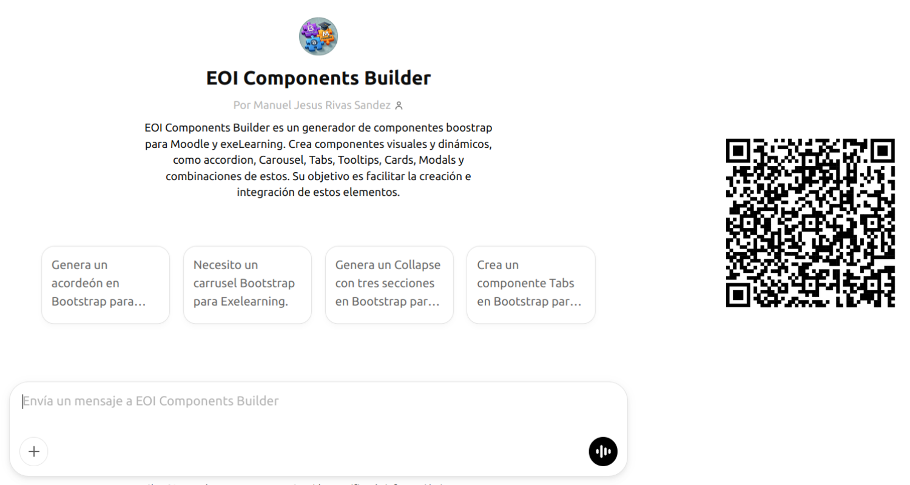
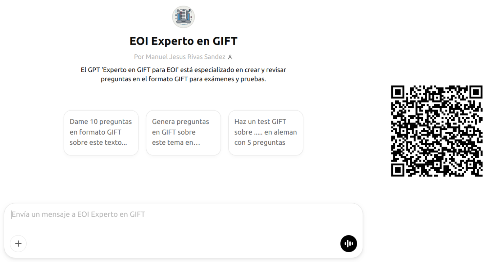
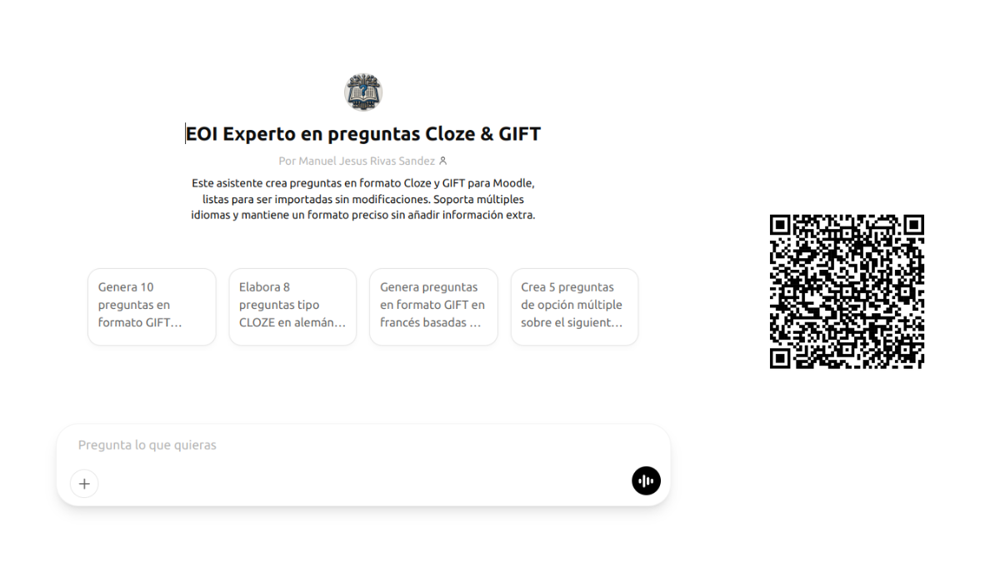
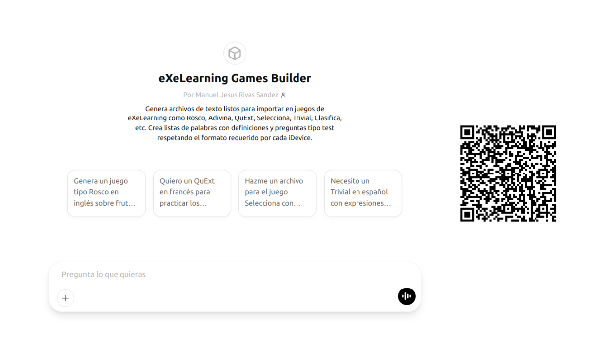
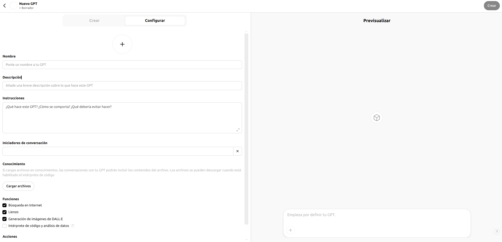
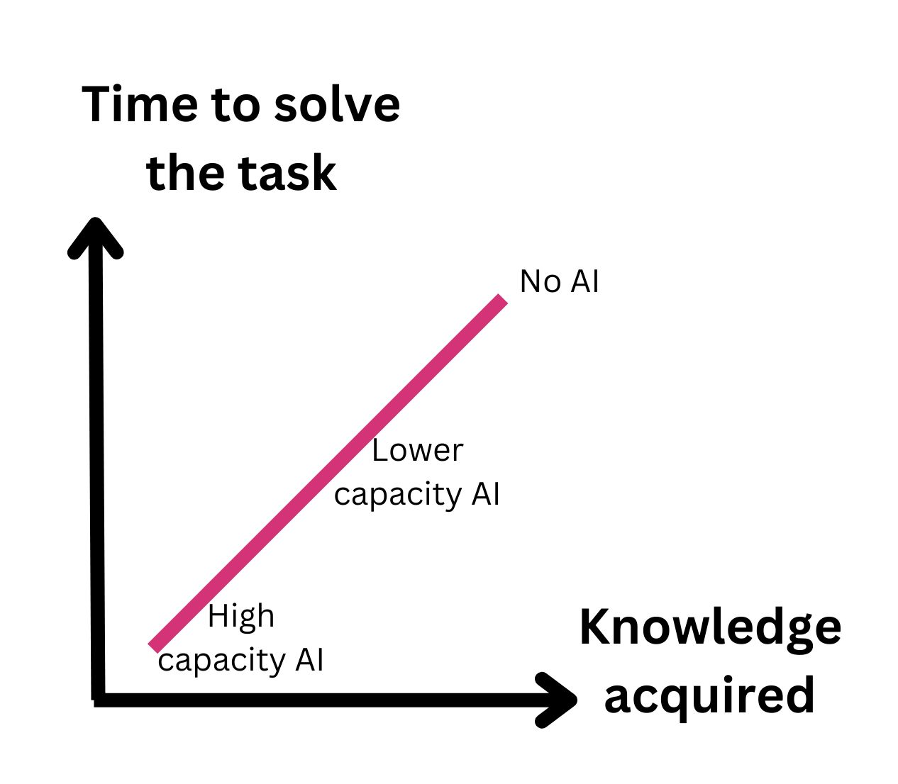
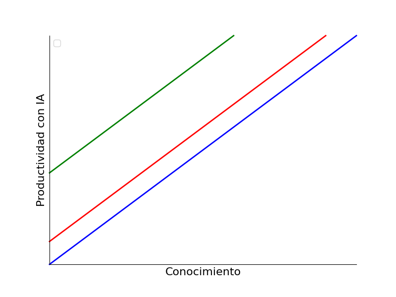
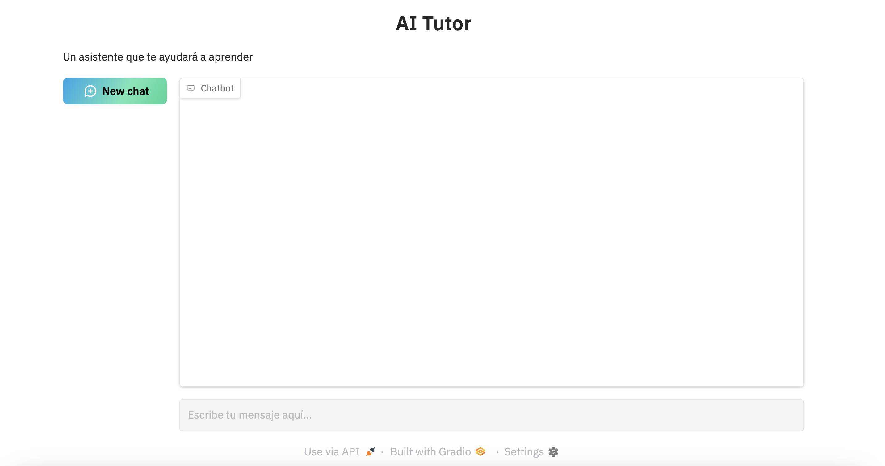
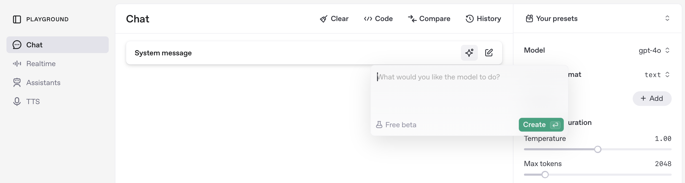

## Inteligencia artificial

---

## Una Inteligencia Artificial para la enseñanza

---

## ¿Han surgido dudas desde la sesión anterior?

---

## Lo que quedó pendiente y novedades

- Mejoras en la generación de imágenes (ChatGPT) <!-- .element: class="fragment" -->

---

## Un asistente personalizado para la productividad

## Pon a prueba al asistente IA

<small>[EOI Components Builder](https://chatgpt.com/g/g-674a0692667481919e18b49c9dffb7d7-eoi-components-builder)</small>

## 

<small>[GIF Builder](https://chatgpt.com/g/g-67b63bda8e448191b138610574b0f81d-eoi-experto-en-gift)</small>

## 

<small>[CLOZE & GIF Builder](https://chatgpt.com/g/g-67b8b2b04ebc8191816a2007c3533902-eoi-experto-en-preguntas-cloze-gift)</small>

## 

<small>[eXeLearning Games Builder](https://chatgpt.com/g/g-67e84a2536dc8191b8ea454223878d55-exelearning-games-builder)</small>

##  Pasos para crear tu propio asistente

- Preparar el "System Prompt"<!-- .element: class="fragment" -->

- Seleccionar la información de "entrenamiento" (documentos, enlaces..)<!-- .element: class="fragment" -->

- Publicarlo en una plataforma como [Chat GPT](https://help.openai.com/en/collections/8475420-gpts) (Solo versión de pago) o [HuggingChat](https://huggingface.co/chat/assistants)
<!-- .element: class="fragment" -->

Note: 

- Preparar el "System Prompt": Define detalladamente el rol y comportamiento que deseas para tu GPT, incluyendo instrucciones claras sobre su tono, estilo y ámbito de respuestas.

- Seleccionar y cargar documentos de entrenamiento: Elige materiales relevantes (artículos, guías, apuntes) que servirán como base de conocimiento para el GPT.

- Configurar el GPT en la plataforma: Utiliza herramientas como ChatGPT Plus para crear y personalizar tu GPT, siguiendo las instrucciones de configuración y cargando los documentos seleccionados. Tambien puedes usar HuggingChat de manera gratuita, la limitación es que no puedes cargar documentos.

## Construyendo un asistente IA paso a paso

---

## Un asistente para cada estudiante

<video style="text-align: center" src="../imagenes/MathproblemswithGPT-4o.mp4" controls>
<track
    label="Español"
    kind="subtitles"
    srclang="es"
    src="../imagenes/MathproblemswithGPT-4o.vtt"
    default />
</video>

<small>Salman Khan, mayo 2024</small>

## 
Un asistente virtual diseñado específicamente para atender las necesidades educativas, adaptándose al contenido y estilo requeridos por docentes y estudiantes.

## 

- Asistente con el material del tema: Responde dudas y guía el aprendizaje de los estudiantes. 

- Personajes históricos o escritores: Para entrevistas y simulaciones en historia o literatura. <!-- .element: class="fragment" -->
- Asistentes de idiomas: Práctica interactiva de conversación y gramática. <!-- .element: class="fragment" -->

## Estudio con tutores IA - 1

Clase de física en Harvard

Grupo con tutor IA aprendió el doble que el grupo con docente

En menos tiempo

Clave: Personalización

<small>[AI Tutoring Outperforms Active Learning](https://www.researchsquare.com/article/rs-4243877/v1). Harvard, mayo 2024</small>

## Estudio con tutores IA - 2

Estudio en Nigeria usando GPT-4 como tutor

Estudiantes no sabían manejar ordenador antes

Se les enseñó a usar el ordenador y GPT-4 como tutor

6 semanas con GPT-4 = 2 años académicos

80% mejor que otras intervenciones educativas, especialmente en niñas

<small>[From chalkboards to chatbots: Transforming learning in Nigeria, one prompt at a time](https://blogs.worldbank.org/en/education/From-chalkboards-to-chatbots-Transforming-learning-in-Nigeria). Enero 2025</small>

## Estudio con tutores IA - 3

MIT

3 grupos: Sin IA (Google), con CodeLlama y con GPT-4

Mejor IA: Menos tiempo para completar la tarea

Mejor IA: Menos aprendizaje

<small>[The Impact of AI on Computer Science Education](https://cacm.acm.org/news/the-impact-of-ai-on-computer-science-education/). MIT, julio 2024</small>

## La Inteligencia Artificial es...

La mejor tecnología para el aprendizaje <!-- .element: class="fragment" -->

La peor tecnología para el aprendizaje <!-- .element: class="fragment" -->

## Claves para aprender con IA

No cualquier uso es válido <!-- .element: class="fragment" -->

Necesitamos tiempo, dedicación y esfuerzo para aprender <!-- .element: class="fragment" -->

Uso de IA en el proceso, no para conseguir un resultado <!-- .element: class="fragment" -->

Aprender ≠ Producir <!-- .element: class="fragment" -->

## Pon a prueba al tutor IA

## 

<small>[The Great Phrasal Verb Adventure](https://app.schoolai.com/spaces/cm7dmdnk001x21110j048hjph)</small>

<small>[Millionen-Quiz der Verben](https://app.schoolai.com/spaces/cm7dl73jb00t59xmur65asp6a)</small>

<small>[Les Chefs du Français](https://app.schoolai.com/spaces/cm7dn5f1602k237skdytic49f)</small>

---

## Anatomía de un tutor de Inteligencia Artificial

## ¿Cómo se construye un tutor IA?

Un buen system prompt: único requisito obligatorio <!-- .element: class="fragment" -->

Opcional - Un sistema RAG para una mayor personalización (conocimiento, ejemplos de ejercicios y resolución...) <!-- .element: class="fragment" -->

¿Y si necesitamos que busque en Internet, resuelva cálculos matemáticos...? → Tendremos que añadirle alguna tool <!-- .element: class="fragment" -->

##  Pasos para crear tu propio asistente educativo

- Preparar el "System Prompt"<!-- .element: class="fragment" -->

- Seleccionar la información de "entrenamiento" (documentos,enlaces..)<!-- .element: class="fragment" -->

- Publicarlo en una plataforma como [Chat GPT](https://help.openai.com/en/collections/8475420-gpts) (Solo versión de pago) o [HuggingChat](https://huggingface.co/chat/assistants)
<!-- .element: class="fragment" -->

Note: 

- Preparar el "System Prompt": Define detalladamente el rol y comportamiento que deseas para tu GPT, incluyendo instrucciones claras sobre su tono, estilo y ámbito de respuestas.

- Seleccionar y cargar documentos de entrenamiento: Elige materiales relevantes (artículos, guías, apuntes) que servirán como base de conocimiento para el GPT.

- Configurar el GPT en la plataforma: Utiliza herramientas como ChatGPT Plus para crear y personalizar tu GPT, siguiendo las instrucciones de configuración y cargando los documentos seleccionados. Tambien puedes usar HuggingChat de manera gratuita, la limitación es que no puedes cargar documentos.

## Construyendo un asistente IA paso a paso

## Otras plataformas para asistentes educativos

- [Schoolai](https://schoolai.com/) <!-- .element: class="fragment" -->

- [Mizou](https://mizou.com/bot) <!-- .element: class="fragment" -->

---

## El idioma de los modelos de lenguaje

<small>https://stackedit.io</small>

## Creando un prompt con ayuda

<small>[Metaprompt de OpenAI](../recursos/metaprompt.md)</small>

---

<!-- .slide: data-background-video="../imagenes/chatgpt.mp4" data-background-opacity="0.6" data-background-video-loop data-background-video-muted -->

## ¿Dudas?
---

## ¡ Escanea, y Opina !

<small>https://app.wooclap.com/MJGERM/questionnaires/67e867b5b283664651456da5</small>

---

## Recursos

<small>https://0xmrivas.github.io/formacion-profesorado-IA-EOI-ElPuertodeSantaMaria/</small>

---

## Contacto

 Manuel J. Rivas Sández 
 <small>
- **Email:** [0xmrivas@proton.me](mailto:0xmrivas@proton.me)
- **Telegram:** [@xmrivas](https://t.me/xmrivas)
- **Twitter:** [@0xmrivas](https://twitter.com/0xmrivas)

- 💼 **PES SAI en el IES Rafael Alerti**

🛡️ Amante del **Hacking Etico** y la **Seguridad Informática**
</small> 